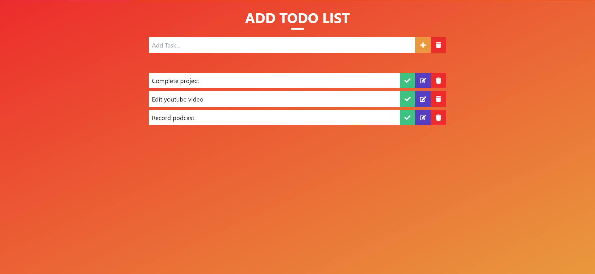
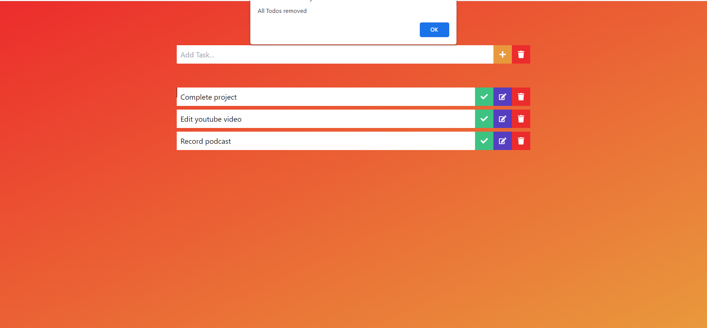
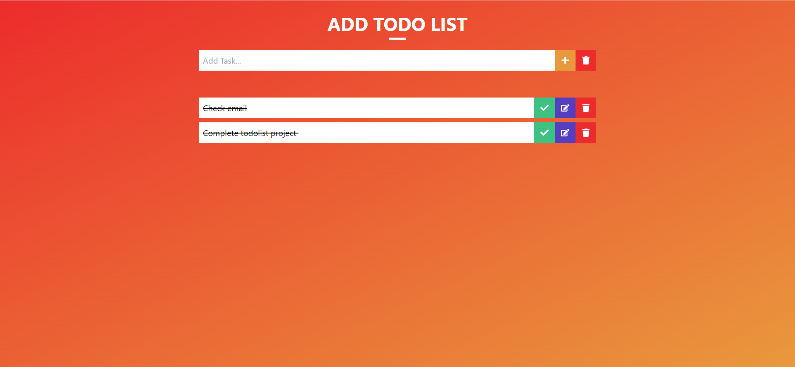

# Todo App 

This Todo App was created using React and TailwindCSS. From this project, I got to learn more about react useState and useEffect. From this project, I got to learn about how to get data and store data in local storage.

# Demo: 

### smartphone view

